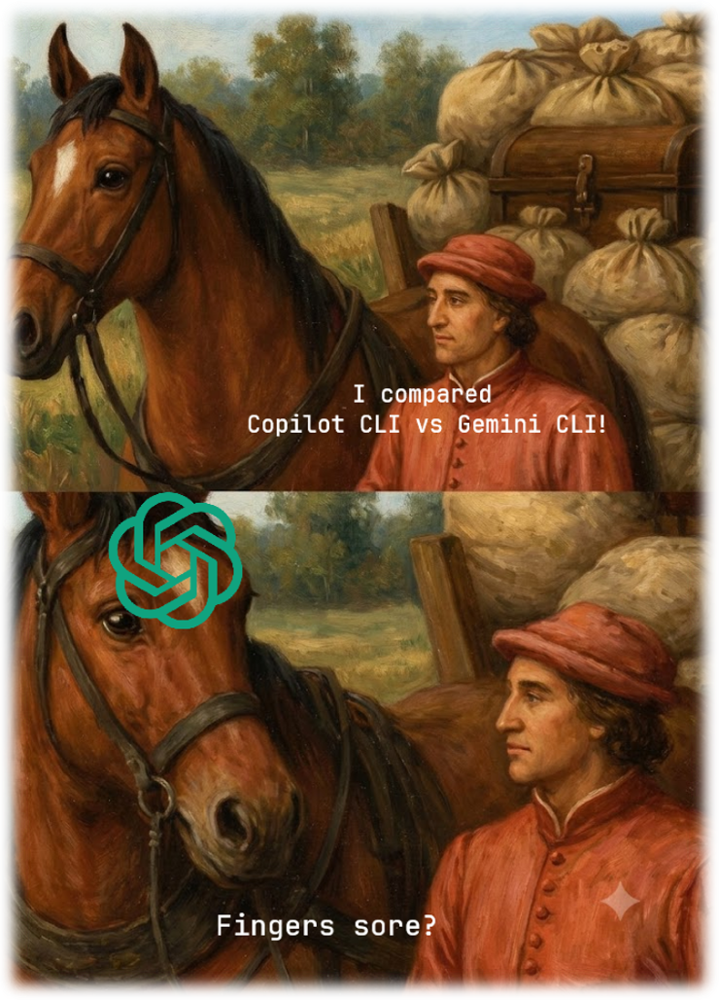

+++
date = '2026-07-30T00:25:35+02:00'
draft = true
title = 'Copilot CLI vs Gemini CLI: Command Comparison'
tags = ["aiTools"]
author = ["Aleksandr T."]
+++

### Hello there! 🖖

### Overview

**Copilot CLI looks stronger in:**

- GitHub workflow;
- code review and security review;
- diff management;
- sandbox and permissions;
- parallel work through `/fleet`;
- agentic scenarios like `/delegate`, `/rubber-duck`, `/research`;
- worktree and experimental sessions;
- release and CLI version management.

**Gemini CLI looks stronger in:**

- custom slash commands;
- hooks;
- policies and privacy;
- hierarchical memory through `GEMINI.md`;
- explicit IDE integration management;
- background shell process management;
- folder trust;
- explicit extension management commands.

## Command Comparison: Copilot CLI vs Gemini CLI

I compare only fixed, built-in interactive commands:

- slash commands;
- documented `@` forms;
- documented `!` forms.

The comparison does not include:

- CLI startup options;
- environment variables;
- keyboard shortcuts;
- user-defined commands;
- undocumented or experimental features.

If one CLI has a command, but the other CLI only has a similar scenario without a direct documented counterpart, I use `X` and explain the difference in the description.

## Core Workflow

### Model, Plans, and Context

- **Model selection**
  - Copilot CLI: `/model`, `/models`
  - Gemini CLI: `/model manage`, `/model set`

  _Copilot also controls reasoning effort and context settings._
- **Planning**
  - Copilot CLI: `/plan`
  - Gemini CLI: `/plan`, `/plan copy`

  _Both support read-only planning before implementation._
- **Context compaction**
  - Copilot CLI: `/compact`
  - Gemini CLI: `/compress`

  _Both summarize the conversation to recover context capacity._
- **Context usage**
  - Copilot CLI: `/context`
  - Gemini CLI: `X`

  _Copilot visualizes context-window token usage._
- **Prompt tools**
  - Copilot CLI: `/ask`, `/refine`
  - Gemini CLI: `X`

  _Ask a side question or rewrite a rough prompt without losing the current work._

### Sessions and Output

- **Resume a session**
  - Copilot CLI: `/resume`, `/continue`
  - Gemini CLI: `/resume`, `/chat`

  _Gemini's `/chat` is an alias and manages checkpoints too._
- **Session management**
  - Copilot CLI: `/session`, `/sessions`
  - Gemini CLI: `/resume list`, `/resume save`, `/resume delete`, `/resume share`

  _Both inspect, save, resume, share, or delete stored conversation state._
- **Start a new conversation**
  - Copilot CLI: `/clear`, `/new`, `/reset`
  - Gemini CLI: `X`

  _These start a new Copilot conversation._
- **Clear the screen**
  - Copilot CLI: `X`
  - Gemini CLI: `/clear`

  _This clears Gemini's visible terminal history without necessarily resetting the saved session._
- **Export and copy**
  - Copilot CLI: `/share`, `/export`, `/copy`
  - Gemini CLI: `/resume share`, `/copy`

  _Copilot supports links, Markdown, HTML, and gists; Gemini exports Markdown or JSON._

## Recovery, Review, and Safety

- **Undo changes**
  - Copilot CLI: `/undo`, `/rewind`
  - Gemini CLI: `/restore`, `/rewind`

  _Copilot rewinds a turn; Gemini can restore a checkpoint from before a tool call._
- **Code review**
  - Copilot CLI: `/review`, `/security-review`, `/diff`
  - Gemini CLI: `X`

  _Copilot offers dedicated review, security-review, and diff workflows._
- **Sandboxing**
  - Copilot CLI: `/sandbox`
  - Gemini CLI: `X`

  _Configure Copilot's OS-level sandbox for shell, MCP, LSP, and built-in tools._
- **Permissions**
  - Copilot CLI: `/permissions`, `/reset-allowed-tools`, `/allow-all`, `/yolo`
  - Gemini CLI: `/permissions trust`

  _Copilot manages session approvals; Gemini manages folder trust._

## Workspace, MCP, and IDE

- **MCP servers**
  - Copilot CLI: `/mcp list`, `/mcp show`, `/mcp add`, `/mcp edit`, `/mcp delete`, `/mcp disable`, `/mcp enable`, `/mcp auth`, `/mcp reload`, `/mcp search`
  - Gemini CLI: `/mcp auth`, `/mcp desc`, `/mcp disable`, `/mcp enable`, `/mcp list`, `/mcp reload`, `/mcp schema`

  _Gemini exposes schemas; Copilot can add and edit servers interactively._
- **Workspace directories**
  - Copilot CLI: `/add-dir`, `/list-dirs`, `/cwd`, `/cd`
  - Gemini CLI: `/directory add`, `/directory show`, `/dir`

  _Gemini adds workspace roots; Copilot can also change the session directory._
- **Environment and tools**
  - Copilot CLI: `/env`, `/lsp`
  - Gemini CLI: `/tools`

  _Copilot shows loaded resources and configures language servers; Gemini lists available tools._
- **IDE integration**
  - Copilot CLI: `/ide`
  - Gemini CLI: `/ide enable`, `/ide disable`, `/ide install`, `/ide status`

  _Gemini exposes explicit integration lifecycle commands._
- **Project instructions**
  - Copilot CLI: `/init`, `/instructions`
  - Gemini CLI: `/init`, `/memory list`, `/memory refresh`, `/memory show`

  _Both initialize repository guidance; Gemini loads hierarchical `GEMINI.md` memory._

## Agents and Automation

- **Agent configuration**
  - Copilot CLI: `/agent`, `/agents`, `/subagents`
  - Gemini CLI: `/agents list`, `/agents reload`, `/agents enable`, `/agents disable`, `/agents config`

  _Both provide agent discovery and configuration, with different interaction models._
- **Parallel and background work**
  - Copilot CLI: `/fleet`, `/tasks`
  - Gemini CLI: `/shells`, `/bashes`

  _Copilot runs parallel subagents; Gemini exposes background shells._
- **Delegation and research**
  - Copilot CLI: `/delegate`, `/rubber-duck`, `/research`
  - Gemini CLI: `X`

  _Delegate a change, request a second opinion, or research a topic._
- **GitHub workflow**
  - Copilot CLI: `/pr`
  - Gemini CLI: `/setup-github`

  _Copilot manages the current pull request; Gemini configures GitHub Actions for triage and reviews._
- **Experimental session branching**
  - Copilot CLI: `/fork`, `/branch`, `/worktree`, `/move`
  - Gemini CLI: `X`

  _Fork a session or create and use an isolated Git worktree._

## Extensions and Customization

- **Extensions and plugins**
  - Copilot CLI: `/plugins`, `/plugin`, `/extensions`, `/extension`
  - Gemini CLI: `/extensions config`, `/extensions disable`, `/extensions enable`, `/extensions explore`, `/extensions install`, `/extensions link`, `/extensions list`, `/extensions restart`, `/extensions uninstall`, `/extensions update`

  _Both manage extensions; Copilot also integrates plugins, marketplaces, MCP servers, and skills in one dashboard._
- **Skills**
  - Copilot CLI: `/skills list`, `/skills info`, `/skills add`, `/skills remove`, `/skills reload`
  - Gemini CLI: `/skills enable`, `/skills disable`, `/skills list`, `/skills reload`

  _Both discover, enable, and manage reusable agent skills._
- **Custom commands**
  - Copilot CLI: `X`
  - Gemini CLI: `/commands list`, `/commands reload`

  _Gemini lists or reloads user-defined slash-command definitions._
- **Settings and appearance**
  - Copilot CLI: `/settings`, `/config`, `/theme`, `/statusline`, `/footer`
  - Gemini CLI: `/settings`, `/theme`

  _Copilot can target repository or local setting scopes and customize the status line._
- **Input preferences**
  - Copilot CLI: `/terminal-setup`, `/voice`
  - Gemini CLI: `/terminal-setup`, `/vim`

  _Both configure multiline input; voice is Copilot-only and Vim mode is Gemini-only._
- **Hooks and policies**
  - Copilot CLI: `X`
  - Gemini CLI: `/hooks`, `/policies`, `/privacy`

  _Gemini manages lifecycle hooks, policies, and privacy consent._

## Operations and Diagnostics

- **Keep awake and experimental controls**
  - Copilot CLI: `/keep-alive`, `/caffeinate`, `/experimental`
  - Gemini CLI: `X`

  _Keep the machine awake or change experimental Copilot features._
- **Scheduled work**
  - Copilot CLI: `/after`, `/every`
  - Gemini CLI: `X`

  _Schedule delayed or recurring prompts, skills, or supported commands in experimental mode._
- **Remote session controls**
  - Copilot CLI: `/remote`, `/rename`, `/restart`, `/search`, `/find`
  - Gemini CLI: `X`

  _Control, restart, rename, or search a Copilot session._
- **Release management**
  - Copilot CLI: `/changelog`, `/release-notes`, `/downgrade`, `/update`, `/upgrade`
  - Gemini CLI: `/upgrade`

  _Gemini opens its upgrade page; Copilot can update or change CLI versions._
- **Usage and limits**
  - Copilot CLI: `/usage`, `/limits`
  - Gemini CLI: `/stats session`, `/stats model`, `/stats tools`

  _Gemini separates session, model, and tool statistics._
- **Identity and feedback**
  - Copilot CLI: `/version`, `/user`, `/login`, `/logout`, `/feedback`, `/bug`, `/app`
  - Gemini CLI: `/about`, `/auth`, `/bug`

  _Copilot additionally launches the Copilot app._
- **Interface previews and help**
  - Copilot CLI: `/clikit`, `/tuikit`, `/help`, `?`
  - Gemini CLI: `/docs`, `/editor`, `/help`, `/?`

  _Both provide command help; the remaining commands preview or open product documentation and UI settings._
- **Exit**
  - Copilot CLI: `/exit`, `/quit`
  - Gemini CLI: `/exit`, `/quit --delete`

  _Gemini can delete the current session history and temporary files on exit._

## Prompt Prefixes

- **Add context**
  - Copilot CLI: `@ FILENAME`
  - Gemini CLI: `@<path>`, `@`

  _Both add a file or directory to the next prompt; Gemini applies Git-aware directory filtering and accepts a lone `@` as a literal character._
- **Run shell commands**
  - Copilot CLI: `! COMMAND`, `!`
  - Gemini CLI: `! COMMAND`, `!`

  _Run one command or enter shell mode for several commands._

## Sources and limitations

The comparison is based on the official documentation as of July 30, 2026:

- [GitHub Copilot CLI command reference](https://docs.github.com/en/copilot/reference/copilot-cli-reference/cli-command-reference)
- [Gemini CLI commands](https://geminicli.com/docs/reference/commands/)

## Blabber

In general, Copilot CLI and Gemini CLI have a pretty similar set of capabilities: model selection, planning, sessions, MCP, workspace, shell commands, skills, and extensions.

But the differences are still clearly visible. Copilot CLI has several interesting agentic scenarios that I did not find in Gemini CLI as direct documented counterparts. For example, `/rubber-duck` is a useful concept for getting a second opinion from another model.

In Gemini CLI, I like the idea of custom commands through `/commands list` and `/commands reload`. This is a convenient way to turn repeated prompts into local commands. Also, hooks, policies, privacy settings, and hierarchical memory through `GEMINI.md` look interesting in Gemini.

So I would not say that one CLI completely replaces the other. Copilot CLI looks more like a GitHub-native agentic coding environment, while Gemini CLI looks more like an extensible local AI tool with good customization.

#### Thanks! Keep calm and code on! 🚀