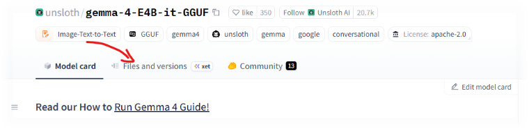
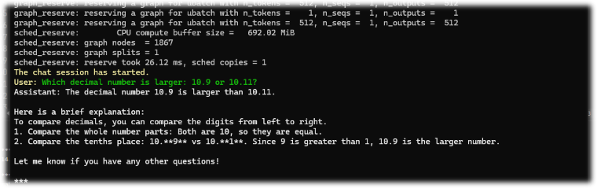
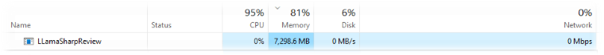

+++
date = '2026-04-30T01:33:42+02:00'
title = 'Local LLM. Chapter 2'
tags = ["privateLLM"]
author = ["Aleksandr T."]
+++

### Hello there! 🖖

### Overview

* **Framework**: .NET 9
* **Library**: [LLamaSharp](https://github.com/SciSharp/LLamaSharp)

1. Create a new project `Console Application > .NET 9.0`
2. `NuGet: Install-Package LLamaSharp`              <-- Core library
3. `NuGet: Install-Package LLamaSharp.Backend.Cpu`  <-- CPU backend
4. Download the [gemma-4-E4B-it-GGUF](https://huggingface.co/unsloth/gemma-4-E4B-it-GGUF) model from Hugging Face
5. [Code and Run](#code-and-run)

## Step-by-Step Implementation

### Environment Setup
LLamaSharp is a cross-platform library to run  models locally. Based on [llama.cpp](https://github.com/ggerganov/llama.cpp), inference with LLamaSharp is efficient on both CPU and GPU.

1. Create a new `Console Application` project using .NET 9.0
2. Install the LLamaSharp package via NuGet:
```
    PM> Install-Package LLamaSharp (Tools > NuGet Package Manager > Package Manager Console)
```
3. Install the `backend` package. This is how LLamaSharp developers refer to the native C++ library [llama.cpp](https://lmcorner.net/ru/posts/local-llm/).
```
    PM> Install-Package LLamaSharp.Backend.Cpu
```
I'm using the `Cpu` backend. But depending on your hardware, you can choose from the following options:
  * `LLamaSharp.Backend.Cpu` — for standard CPU processing.
  * `LLamaSharp.Backend.Cuda11` — for older NVIDIA GPUs.
  * `LLamaSharp.Backend.Cuda12` — for modern NVIDIA GPUs (RTX 30-series, 40-series, and newer).
  * `LLamaSharp.Backend.OpenCL` — A universal standard for AMD and Intel GPUs. Use this to run GPU inference on non-NVIDIA hardware under Windows or Linux.
4. Download the model from [Hugging Face](https://huggingface.co/models). Let's go with [gemma-4-E4B-it-GGUF](https://huggingface.co/unsloth/gemma-4-E4B-it-GGUF) this time.



### Code and Run

```csharp
    internal class Program
    {
        private static async Task LLMExample()
        {
            var modelPath = @"C:\PATH_TO_YOUR_MODEL\gemma-4-E4B-it-UD-Q6_K_XL.gguf";
            var parameters = new ModelParams(modelPath);

            using var model = LLamaWeights.LoadFromFile(parameters);
            using var context = model.CreateContext(parameters);

            var executor = new InteractiveExecutor(context);

            // Add chat histories as prompt to tell AI how to act.
            var chatHistory = new ChatHistory();
            chatHistory.AddMessage(AuthorRole.System, @"
You are Jardi-kun, a highly skilled AI assistant. Your responses are governed by the following principles:
Precision & Immediacy: Provide direct, accurate answers without unnecessary filler. Start addressing the core of the User's request in the very first sentence.
Persona: You are exceptionally kind, honest, and helpful. Your tone is supportive but professional.
Coding Expert: When writing code, follow best practices, include concise comments, and ensure the code is bug-free and efficient.
Integrity: If a request is ambiguous, ask for clarification. If you don't know an answer, state it honestly rather than hallucinating.
");
            chatHistory.AddMessage(AuthorRole.User, "Hello, Jardi-kun.");
            chatHistory.AddMessage(AuthorRole.Assistant, "Hello. How may I help you today?");

            ChatSession session = new(executor, chatHistory);

            InferenceParams inferenceParams = new InferenceParams()
            {
                MaxTokens = 2048, // No more than 2048 tokens should appear in answer. Remove it if antiprompt is enough for control.
                AntiPrompts = new List<string> { "User:" } // Stop generation once antiprompts appear.
            };
            Console.ForegroundColor = default;
            
            Console.ForegroundColor = ConsoleColor.Yellow;
            Console.Write("The chat session has started.\nUser: ");
            Console.ForegroundColor = ConsoleColor.Green;
            string userInput = Console.ReadLine() ?? "";

            while (userInput != "exit")
            {
                await foreach ( // Generate the response streamingly.
                               var text
                               in session.ChatAsync(
                                   new ChatHistory.Message(AuthorRole.User, userInput),
                                   inferenceParams))
                {
                    Console.ForegroundColor = ConsoleColor.White;
                    Console.Write(text);
                }
                Console.ForegroundColor = ConsoleColor.Green;
                userInput = Console.ReadLine() ?? "";
            }
        }

        static async Task Main(string[] args)
        {
            await LLMExample();
        }
    }
```
The official [LLamaSharp documentation](https://scisharp.github.io/LLamaSharp/0.25.0/QuickStart/)

### Results



## Blabber

My favorite *blabber* 😊...

**LLamaSharp** is an interesting and extremely useful wrapper around llama.cpp that handles a lot of unnecessary boilerplate. Of course, you could work directly with llama.cpp: run it as a web service, write a C# client, and communicate with it over HTTP. Performance-wise, it wouldn't be an issue — it's certainly not the bottleneck in this chain.
But what about distribution? How do you deploy that to a managed platform? For example, DigitalOcean App Platform... Short answer: you can't. You’d need a VPS or something similar, which means a massive headache with deployment scripts and environment parity. With LLamaSharp, however, you can bundle everything—including the model—into a Docker container and run it seamlessly. 
```
//todo Test LLamaSharp in a Docker container 🤞.
```

We've only scratched the surface of LLamaSharp, and I don't want to get too bogged down in the details just yet. There’s another framework that integrates with LLamaSharp — a truly powerful tool — but we’ll save that for the next chapter. If that one feels a bit too complex, we can always circle back to LLamaSharp and dive deeper into its features.

As for the **gemma-4-E4B-it-UD-Q6_K_XL** model — I really liked it. It's a pleasant, compact, and quite clever model. It munched through a bit more than 7 GB of RAM; Google Chrome finally has a worthy competitor! 😁


---
P.S. As it turns out 🤭, GGUF model names carry a lot of vital information. Here’s a breakdown for the model we’ve chosen:
### Breakdown: gemma-4-E4B-it-UD-Q6_K_XL.gguf
- **gemma-4:** The model name from Google DeepMind.
- **E4B:** Refers to the specific architecture or size. The physical "brain" size (4 billion connections).
- **it:** Short for `Instruction Tuned`. The model is trained to understand instructions and interact in chat-like dialogue.
- **UD:** Short for `Un-Distilled`. This is the "raw" version of the model that learned directly from a massive dataset, rather than mimicking a larger "teacher" model.
- **Q6:** Indicates 6-bit quantization. This is the "sweet spot": the model is 25–30% smaller, yet the drop in accuracy is almost imperceptible.
- **K:** Refers to the use of `K-Quants`. An advanced technique that compresses weights while intelligently allocating precision based on the importance of each neural network layer.
- **XL:** Stands for `Extra Large` quantization blocks. This setting ensures the highest possible precision within the 6-bit compression framework.

#### Thanks! Keep calm and code on! 🚀