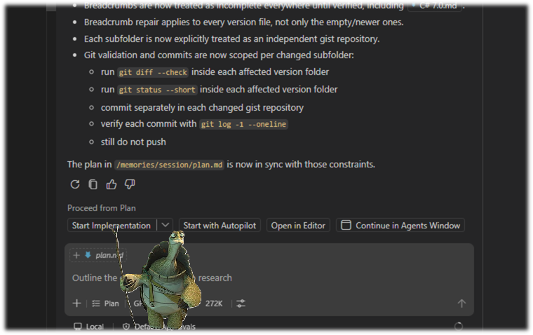

+++
date = '2026-06-08T01:41:51+02:00'
title = 'AI: Plan Mode'
tags = ["plan-mode", "other"]
author = ["Aleksandr T."]
+++

### Hello there! 🖖

### Overview

* **IDE:** VS Code
* **Technologies:** GitHub Gist, Microsoft Learn MCP Server
* **Goal:** Create a series of gist notes about the evolution of C# from version 7.0 to 14.0.
* **Approach:** Plan mode with task breakdown, prioritization, and execution in `autopilot`.

**Result:** 
[C# 7.0](https://gist.github.com/AleksandrTurkin/43aacb6a5be3f94377f4467da4ecc5e1) > 
[C# 7.1](https://gist.github.com/AleksandrTurkin/e11815f52d09b8a3fe481f00a2bfa1df) > 
[C# 7.2](https://gist.github.com/AleksandrTurkin/673c9e3d3529d80f208fcdac8547bb8c) > 
[C# 8.0](https://gist.github.com/AleksandrTurkin/a080ee2b1dfdf4c7ce42f39b837c8c68) > 
[C# 9.0](https://gist.github.com/AleksandrTurkin/b29cbe7a9d0fc092984d81846ef57490) > 
[C# 10.0](https://gist.github.com/AleksandrTurkin/7d24dbb92054a6297290199fa4df7403) > 
[C# 11.0](https://gist.github.com/AleksandrTurkin/78981186bdcab633bd47a2e577a16da3) > 
[C# 12.0](https://gist.github.com/AleksandrTurkin/ad070f9b4d3416afb58fa76353ea667a) > 
[C# 13.0](https://gist.github.com/AleksandrTurkin/7530b9e69c193f77f77209d244cb0034) > 
[C# 14.0](https://gist.github.com/AleksandrTurkin/1615fea4dbb6c1cf57ae8087f9b8f757)

## Practice

**Plan mode** is when the AI agent doesn't immediately start changing files but instead creates a plan: what needs to be done, in what order, and what artifacts should be produced as output.

In my case, the task was quite straightforward: I already had several prepared gist notes and a clear format. I just needed to complete the series and bring everything to a unified look.

### Plan Creation

1. **Goal**

Create a plan for a series of gist notes that briefly describe the evolution of the C# language.

2. **Task Breakdown**

   - Define the structure and format of each gist based on the existing notes: [C# 7.0](https://gist.github.com/AleksandrTurkin/43aacb6a5be3f94377f4467da4ecc5e1), [C# 7.1](https://gist.github.com/AleksandrTurkin/e11815f52d09b8a3fe481f00a2bfa1df), [C# 7.2](https://gist.github.com/AleksandrTurkin/673c9e3d3529d80f208fcdac8547bb8c), [C# 8.0](https://gist.github.com/AleksandrTurkin/a080ee2b1dfdf4c7ce42f39b837c8c68).
   - Create a single template for all notes.
   - Find information about the new features in each C# version.
   - Fill each gist with specific content and examples.
   - Confirm the information through the `Microsoft Learn` MCP server if necessary.
   - Add breadcrumbs between gists for easier navigation.
   - Update the existing gists, since breadcrumbs had not been implemented there yet.
   - Check that all gists are formatted consistently.
   - Make a commit, but do not push it yet, so the result can be reviewed first 😇.

3. **Task Prioritization**

   - First, create a template to build a unified format.
   - Then, prepare each C# version content.
   - After that, add breadcrumbs and navigation between gists.
   - Finally, make edits to existing gists, check for uniformity, and make a commit.

### Plan Execution

I usually use plan mode in `VS Code`. Historically, this mode appeared there much earlier than in `Visual Studio`, and, at least for me, it works more reliably.

While creating the plan, the agent may ask several clarifying questions. The result is a `plan.md` file with a clear action plan. After that, `VS Code` asks for confirmation to execute the plan.

I used `autopilot` mode: the agent executes the approved plan without my constant involvement, and I check the result afterward.

## Blabber

I planned to write several gists as short notes about how the C# language evolved, in a compact format with examples for clarity. I successfully started working on them and just as successfully abandoned them after a couple of days. But recently I remembered them and decided to delegate this task to AI.

The task itself is finite: you create a set of gists for already existing C# versions once, and that's basically it... then you just wait for a new language version, and they are not released very often. There is absolutely no point in creating a dedicated AI agent and describing skills for it. What is needed here is a plan that a standard AI agent can follow to complete all the tasks step by step.

This is exactly where `plan mode` fits perfectly. And in about half an hour, I got the result that I had been procrastinating on for the last 15 months 😁.

#### Thanks! Keep calm and code on! 🚀