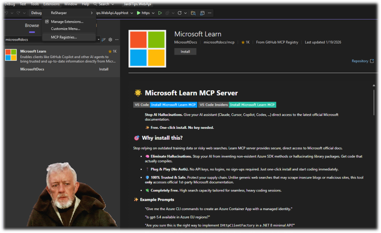

+++
date = '2026-05-12T01:36:44+02:00'
title = 'Агентское программирование. Часть 1: API & Экосистема'
tags = ["agent-coding", "jardi-tips"]
author = ["Александр Т."]
+++

### Всем привет! 🖖

### Краткий обзор

* **Среда разработки:** Visual Studio 2026
* **Фреймворк:** .NET 10
* **Технологии:** ASP.NET Core Web API
* **Архитектура:** Clean Architecture + Vertical Slice Architecture

- [api-features.agent.md](https://github.com/AleksandrTurkin/api-jardi-tips/blob/main/.github/agents/api-features.agent.md) - AI-агент для генерации - операций
- [db-entity-creator](https://github.com/AleksandrTurkin/api-jardi-tips/blob/main/.github/skills/db-entity-creator/SKILL.md) - cкилл для создания сущностей базы и шагов миграции
- [command-query-handler-creator](https://github.com/AleksandrTurkin/api-jardi-tips/blob/main/.github/skills/command-query-handler-creator/SKILL.md) - cкилл для создания обработчиков команд и запросов
- [api-endpoint-creator](https://github.com/AleksandrTurkin/api-jardi-tips/blob/main/.github/skills/api-endpoint-creator/SKILL.md) - cкилл для создания API-эндпоинтов

**Границы ответственности агентских скиллов**
```
Solution/
├── src/
│   ├── MyProject.Domain/          # 1. Скилл: db-entity-creator
│   ├── MyProject.Application/     # 2. Скилл: command-query-handler-creator
│   ├── MyProject.Infrastructure/  # 3. Скилл: db-entity-creator
│   └── MyProject.WebApi/          # 4. Скилл: api-endpoint-creator
```

## Реализация в деталях

### Структура проекта

В качестве структуры проекта была выбрана классическая `Clean Architecture`. Важно, что каждый слой имеет четко определенные границы и зависимости, что облегчает работу AI-агента при генерации кода и поддержании архитектурной целостности.

```
Solution/
├── src/
│   ├── MyProject.Domain/          # 1. Сущности и правила ядра (Нет зависимостей)
│   ├── MyProject.Application/     # 2. Исполняемые сценарии (Зависит от Domain)
│   ├── MyProject.Infrastructure/  # 3. Реализация инфраструктуры (Зависит от Application)
│   └── MyProject.WebApi/          # 4. Точка входа / Хост (Зависит от Infrastructure и Application)
```

### Зоны ответственности AI-агента

[**AI-агент**](https://github.com/AleksandrTurkin/api-jardi-tips/blob/main/.github/agents/api-features.agent.md) на данном этапе автоматизирует добавление новых -операций. Этот процесс можно кратко разбить на следующие шаги:
1. Создание сущностей базы данных в слое `Domain` и шагов миграции для этих сущностей в слое `Infrastructure`.
2. Создание обработчиков команд и запросов в слое `Application` для управления этими сущностями.
3. Создание эндпоинтов в слое `WebApi` для предоставления API-интерфейса к этим операциям.

Каждый из этих шагов реализован как отдельный скилл, а AI-агент применяет их последовательно. 

1. [**db-entity-creator**](https://github.com/AleksandrTurkin/api-jardi-tips/blob/main/.github/skills/db-entity-creator/SKILL.md) - скилл, который отвечает за создание сущностей базы данных внутри слоя `Domain` и шагов миграции внутри слоя `Infrastructure`. 
```
│   ├── MyProject.Domain/
│   │   ├── Entities/              # Сущности базы данных
│   └── MyProject.Infrastructure/
|       ├── Configurations/        # Конфигурации сущностей базы данных
|       └── Migrations/            # Шаги миграции для сущностей базы данных
```

2. [**command-query-handler-creator**](https://github.com/AleksandrTurkin/api-jardi-tips/blob/main/.github/skills/command-query-handler-creator/SKILL.md) - скилл, который отвечает за создание обработчиков команд и запросов внутри слоя `Application` для управления этими сущностями. 
```
│   ├── MyProject.Application/
|   |   └── Features/                # Функциональные возможности (Features)
|   |       └── <Entity>             # Сущность, для которой создаются обработчики
|   |           ├── Create<Entity>CommandHandler.cs        # Обработчики команд Create
|   |           ├── Update<Entity>CommandHandler.cs        # Обработчики команд Update
|   |           ├── Delete<Entity>CommandHandler.cs        # Обработчики команд Delete
|   |           ├── Get<Entity>ByIdQueryHandler.cs         # Обработчики запросов GetById
|   |           └── Get<Entities>QueryHandler.cs           # Обработчики запросов GetAll
```

3. [**api-endpoint-creator**](https://github.com/AleksandrTurkin/api-jardi-tips/blob/main/.github/skills/api-endpoint-creator/SKILL.md) - скилл, который отвечает за создание эндпоинтов внутри слоя `WebApi` для предоставления API-интерфейса к этим операциям. 
```
│   ├── MyProject.WebApi/
|   |  └── Endpoints/                 # Minimal API эндпоинты
|   |     └── <Entity>Endpoints.cs    # Эндпоинты для управления сущностью
```

> Обратите внимание на обобщение [EndpointMapExtensions](https://github.com/AleksandrTurkin/api-jardi-tips/blob/main/JardiTips.WebApi/JardiTips.WebApi/Extensions/EndpointMapExtensions.cs) для добавления новых эндпоинтов. Это расширение позволяет стандартизировать скилл `api-endpoint-creator`, так как все эндпоинты добавляются по одному шаблону.

### Экосистема AI-агента

1. [**copilot-instructions.md**](https://github.com/AleksandrTurkin/api-jardi-tips/blob/main/.github/copilot-instructions.md) - файл, который содержит информацию о структуре проекта, архитектуре, используемых библиотеках и базовое руководство для агентов. Этот файл используется в каждом промпте для понимания контекста. Здесь очень важно соблюдать баланс между детализацией и лаконичностью.

2. [**Microsoft Learn MCP Server**](https://github.com/microsoftdocs/mcp) - MCP-сервер, разработанный для решения проблемы устаревших знаний LLM. Он предоставит AI-агенту прямой доступ к актуальной базе `Microsoft Learn`. 
Например, .NET 10 вышел в ноябре 2025 года, а используемая модель LLM была обучена раньше и объективно не имеет информации о новом фреймворке и свежих языковых спецификациях. MCP-сервер нужен не репозиторию, а рабочему окружению агента/IDE.


3. [**api-features.agent.md**](https://github.com/AleksandrTurkin/api-jardi-tips/blob/main/.github/agents/api-features.agent.md) - специализированный AI-агент, основная задача которого - анализировать требования и добавлять новые API-функциональности в проект, используя скиллы, упомянутые выше.
    - [**db-entity-creator**](https://github.com/AleksandrTurkin/api-jardi-tips/blob/main/.github/skills/db-entity-creator/SKILL.md)
    - [**command-query-handler-creator**](https://github.com/AleksandrTurkin/api-jardi-tips/blob/main/.github/skills/command-query-handler-creator/SKILL.md)
    - [**api-endpoint-creator**](https://github.com/AleksandrTurkin/api-jardi-tips/blob/main/.github/skills/api-endpoint-creator/SKILL.md)

## Болтовня

В этой серии статей я постараюсь описать мое видение правильной экосистемы для AI-агентов, чтобы получать ожидаемый результат на выходе. Это не «вайб-программирование» в чистом виде, как оно сейчас понимается многими. Это некий гибрид, где AI-агент пишет код в очень строгих рамках, а кожаный задает архитектуру и шаблоны, которым надо следовать. Я хочу сопровождаемое приложение, а не одноразовый прототип. Каждый запуск AI-агента должен приносить предсказуемый результат. Для меня это тоже эксперимент: как быстро и насколько эффективно будет идти разработка силами одного старенького программиста 😁.

При реализации базовой структуры проекта было очень важно соблюсти баланс. С одной стороны, хочется сделать унификацию всех операций, чтобы добавление нового CRUD было максимально лаконичным, условно говоря, в пару строчек. По сути, все реализуется через обобщения (Generic), начиная от формирования Endpoint и заканчивая Generic Handlers. Этот подход экономит кучу строчек кода! Ииии... к сожалению, делает ревью этого механизма крайне болезненным. Если в нем были какие-то изменения, то, как правило, без 100 грамм не разобраться.

С другой стороны - а зачем нам экономить строчки кода? Нам же их напилит AI-агент, а за нами остается только ревью. Нам не нужен сложный переусложненный механизм, нам нужен код, легкий для чтения и понимания, пусть даже его будет немного больше. Это одна из причин, почему в проекте нет MediatR и всяких AutoMapper'ов; чем меньше магии и черных ящиков, тем проще AI-агенту писать код и тем легче кожаному разбирать его на ревью.

*Важный момент:* скилл, ответственный за добавление сущностей базы данных **не запускает миграцию**. Доверить AI-агенту автоматическое выполнение миграций в БД я не готов. Слабоумие и отвага — не наш путь 😁.

*- Почему `Clean Architecture`?*

AI-агенты лучше работают с архитектурами, где есть:
* Маленький контекст
* Предсказуемая структура
* Локальность изменений
* Явные зависимости
* Мало *'магии'*

AI-агенту нужны не только промпты, но и экосистема — архитектура, инструкции, скиллы, актуальная документация и понятные границы ответственности. Чем меньше свободы в технических решениях, тем выше шанс получить предсказуемый код 😇

#### Спасибо! Улыбаемся и пашем! 🚀
