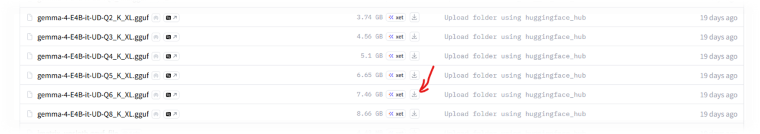

+++
date = '2026-04-30T01:33:34+02:00'
draft = true
title = 'Локальная LLM. Глава 2'
tags = ["privateLLM"]
author = ["Александр Т."]
+++

### Всем привет! 🖖

### Краткий обзор

* **Фреймворк**: .Net 9
* **Библиотека**: [LLamaSharp](https://github.com/SciSharp/LLamaSharp)

1. Создаем новый проект `Console Application > .Net 9.0`
2. `NuGet: Install-Package LLamaSharp`              <-- Устанавливаем пакет LLamaSharp
3. `NuGet: Install-Package LLamaSharp.Backend.Cpu`  <-- Устанавливаем бэкенд (вычисления на CPU)
4. Скачиваем [модель gemma-4-E4B-it-GGUF](https://huggingface.co/unsloth/gemma-4-E4B-it-GGUF) с Hugging Face
5. [Кодим и запускаем](#%D0%BA%D0%BE%D0%B4%D0%B8%D0%BC)

## Развертывание в деталях

### Подоготовка окружения
LLamaSharp - кроссплатворменная библиотека для работы с LLM на локальном окружении. Основана на [llama.cpp](https://github.com/ggerganov/llama.cpp), поддерживает работу на CPU и GPU.

1. Создаем новый проект `Console Application`. Фрэймворк .Net 9.0
2. Устанавливаем пакет LLamaSharp через NuGet:
```
    PM> Install-Package LLamaSharp (Tools > NuGet Package Manager > Package Manager Console)
```
3. Устанавливаем `бэкенд` пакет. Так разработчики LLamaSharp называют нативную скомпилированную c++ библиотеку (нашу любимую [llama.cpp](https://lmcorner.net/ru/posts/local-llm/)).
```
    PM> Install-Package LLamaSharp.Backend.Cpu
```
В моем случае, я использую `Cpu` бэкенд. Но в зависимости от вашего сетапа, вы можете выбрать следующие варианты:
  - `LLamaSharp.Backend.Cpu` - для процессоров 
  - `LLamaSharp.Backend.Cuda11` - для старых видеокарт NVIDIA.
  - `LLamaSharp.Backend.Cuda12` - для современных видеокарт NVIDIA (RTX 30-й, 40-й серий и выше).
  - `LLamaSharp.Backend.OpenCL` - для видеокарт AMD и Intel. Универсальный стандарт, который позволяет запустить вычисления на GPU от других производителей (не NVIDIA) под Windows и Linux.

4. Скачиваем модель с [Hugging Face](https://huggingface.co/models). В этот раз давайте попробуем [gemma-4-E4B-it-GGUF](https://huggingface.co/unsloth/gemma-4-E4B-it-GGUF)




### Кодим

```csharp
    internal class Program
    {
        private static async Task LLMExample()
        {
            var modelPath = @"C:\gguf-models\gemma-4-E4B-it-UD-Q6_K_XL.gguf";
            var parameters = new ModelParams(modelPath);

            using var model = LLamaWeights.LoadFromFile(parameters);
            using var context = model.CreateContext(parameters);

            var executor = new InteractiveExecutor(context);

            // Add chat histories as prompt to tell AI how to act.
            var chatHistory = new ChatHistory();
            chatHistory.AddMessage(AuthorRole.System, @"
You are Jardi-kun, a highly skilled AI assistant. Your responses are governed by the following principles:
Precision & Immediacy: Provide direct, accurate answers without unnecessary filler. Start addressing the core of the User's request in the very first sentence.
Persona: You are exceptionally kind, honest, and helpful. Your tone is supportive but professional.
Coding Expert: When writing code, follow best practices, include concise comments, and ensure the code is bug-free and efficient.
Integrity: If a request is ambiguous, ask for clarification. If you don't know an answer, state it honestly rather than hallucinating.
");
            chatHistory.AddMessage(AuthorRole.User, "Hello, Jardi-kun.");
            chatHistory.AddMessage(AuthorRole.Assistant, "Hello. How may I help you today?");

            ChatSession session = new(executor, chatHistory);

            InferenceParams inferenceParams = new InferenceParams()
            {
                MaxTokens = 2048, // No more than 2048 tokens should appear in answer. Remove it if antiprompt is enough for control.
                AntiPrompts = new List<string> { "User:" } // Stop generation once antiprompts appear.
            };
            Console.ForegroundColor = default;
            
            Console.ForegroundColor = ConsoleColor.Yellow;
            Console.Write("The chat session has started.\nUser: ");
            Console.ForegroundColor = ConsoleColor.Green;
            string userInput = Console.ReadLine() ?? "";

            while (userInput != "exit")
            {
                await foreach ( // Generate the response streamingly.
                               var text
                               in session.ChatAsync(
                                   new ChatHistory.Message(AuthorRole.User, userInput),
                                   inferenceParams))
                {
                    Console.ForegroundColor = ConsoleColor.White;
                    Console.Write(text);
                }
                Console.ForegroundColor = ConsoleColor.Green;
                userInput = Console.ReadLine() ?? "";
            }
        }

        static async Task Main(string[] args)
        {
            await LLMExample();
        }
    }
```
Официальная документация [LLamaSharp](https://scisharp.github.io/LLamaSharp/0.25.0/QuickStart/)

### Результат


## Болтовня

Моя любимая *болтовня* 😊...

**LLamaSharp** - интересная и крайне полезная обертка над llama.cpp, которая решает очень много ненужной рутины. Конечно, можно работать напрямую с llama.cpp, запустить как веб сервис, написать на C# клиента и общаться с ней через HTTP. По производительности не будет никаких проблем, это так сказать, не самое медленное звено в этой цепочке. Но как насчет дистрибьюции? Как развернуть это все где-нибудь на хостинге!? Например в DigitalOcean App Platform... А ни как, нужен VPS и что-то подобное, кучю боли со скриптами для автоматического развертывания и т.п.. А с LLamaSharp можно положить все в Docker контейнер вместе с моделью и запустить без каких либо проблем (Я еще не проверял эту гепотизу лично, но почти уверен, что вариант  рабочий 🤞).

Библиотека LlamaSharp раскрыта только поверхностно и я не хочу на ней фокусирвоаться сейчас, есть еще один фрэймворк, который интегрируется с LLamaSharp и это довльно мощный инструмент, но об этом в следующей главе. Если не понравится и окажется слишком громоздким, то всегда можно вернуться к LlamaSharp и раскрыть его по подробней.

По самой модели **gemma-4-E4B-it-UD-Q6_K_XL**, мне понравилась, приятная, компактная, умненькая модель. Скушала чуть больше 7 гб оперативной памяти, у Google Chrome прям появился конкурент 😁.


---
P.S. Названия guff моделей, оказывается 🤭, тоже несут в себе очень важную информацию, прилагаю расшифровку для модели которую мы выбрали. 
### Расшифровка: gemma-4-E4B-it-UD-Q6_K_XL.gguf
- **gemma-4:** Имя модели от Google DeepMind.
- **E4B:** Указывает на размер или специфическую архитектуру модели. Физический размер «мозга» (4 миллиарда связей).
- **it:** Сокращение от `Instruction Tuned`. Модель «натаскана» понимать инструкции и общаться в формате чата.
- **UD:** Сокращение от `Un-Distilled`. Это «первичная» версия модели, которая обучалась самостоятельно на большом массиве данных, а не копировала поведение более крупной «нейросети-учителя».
- **Q6:** Означает 6 бит на параметр. Это «золотая середина» квантования: модель на 25–30% легче, но разницы практически не заметить.
- **K:** Указывает на использование метода `K-Quants`. Это продвинутая технология, которая сжимает веса и распределяет точность в зависимости от важности конкретного участка нейросети.
- **XL:** Обозначение `Extra Large` для конфигурации блоков квантования. Это означает, что при создании файла использовались настройки для максимально возможного сохранения точности в рамках 6-битного сжатия.

#### Спасибо! Улыбаемся и пашем! 🚀
