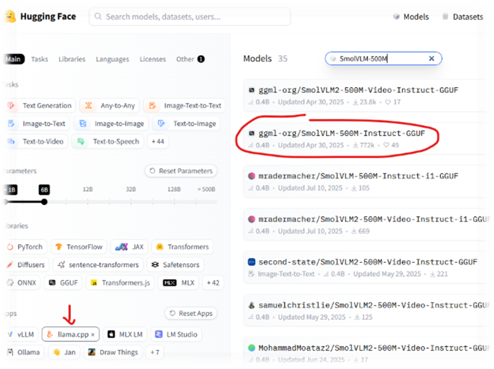
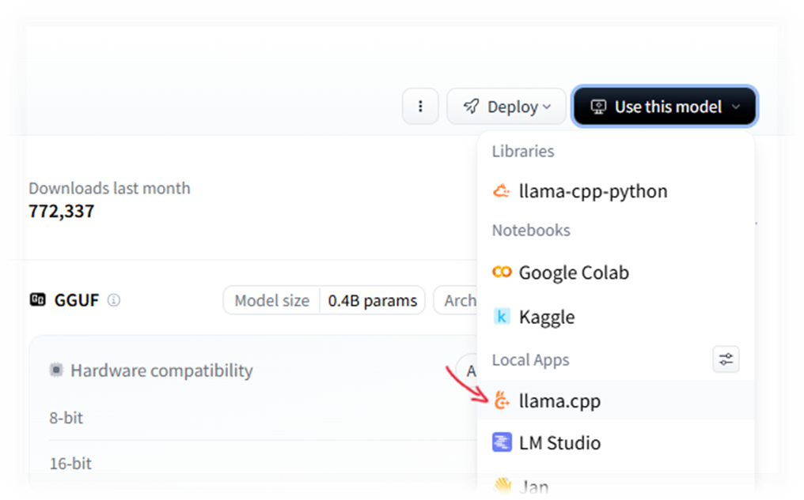
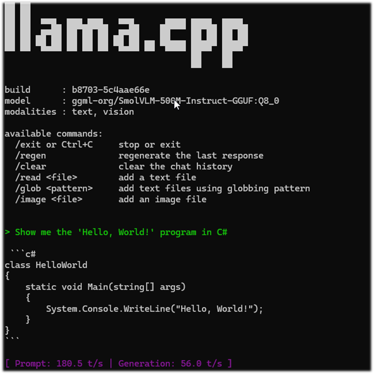

+++
date = '2026-03-23T23:53:44+01:00'
title = 'Локальная LLM. Глава 1'
tags = ['privateLLM']
author = ["Александр Т."]
+++

### Всем привет! 🖖

### Краткий обзор
* **Инструмент:** llama.cpp
* **ОС**: Windows

```
1. [Hugging Face Models](https://huggingface.co/models)
2. App: llama.cpp
3. Model: SmolVLM-500M-Instruct-GGUF
4. Win + R -> winget install llama.cpp
5. CMD -> llama-cli -hf ggml-org/SmolVLM-500M-Instruct-GGUF:Q8_0

/// Удаление
1. winget list llama.cpp
2. winget uninstall --id ggml.llamacpp
```

## Развертывание в деталях

### Быстрый способ запустить llama.cpp на Windows

1. Переходим на [Hugging Face Models](https://huggingface.co/models)
  * **App:** llama.cpp 
  * **Model:** SmolVLM-500M-Instruct-GGUF


2. Нажимаем "Use this model" -> "llama.cpp"
  * В открывшемся окне появятся инструкции по установке llama.cpp и команда для запуска выбранной модели.


3. Используем WinGet для установки и запуска:
```
# Нажимаем Win + R и вводим powershell (или используем Терминал)

# 1. Устанавливаем llama.cpp через менеджер пакетов Windows
winget install llama.cpp

# 2. Скачиваем и запускаем модель прямо из Hugging Face в консоли
llama-cli -hf ggml-org/SmolVLM-500M-Instruct-GGUF:Q8_0
```


### Удаление llama.cpp

1. Сначала проверьте точное название установленного пакета:
```
winget list llama.cpp
```

2. Затем удалите его по ID
```
winget uninstall --id ggml.llamacpp
```

**! Важный момент:** Папка со скачанной моделью не удалится автоматически, её нужно удалить вручную. Обычно она находится по пути
`C:\Users\%USERNAME%\.cache\huggingface\hub`

## Болтовня
Зачем нам нужна своя локальная  (далее -  😇)?

На самом деле, 99.99% задач уже покрывают существующие сервисы. Я даже не буду пытаться их перечислять: новые инструменты появляются каждый день, и уследить за этим потоком невозможно.

```
  //todo Придумать как уследить за потоком обновлений в популярных сервисах и фреймворках 😅
```

Но помимо чисто практического применения, есть еще и академический интерес — когда хочется не только изучить матчасть, но и попробовать всё на практике. Я планирую серию взаимосвязанных статей, где мы вместе выстроим полноценную инфраструктуру: от развертывания модели до её полноценного использования.

На текущий момент есть несколько популярных инструментов для развертывания в локальной среде:

| Инструмент     | Управление                   | Главная фишка                                                                  | Движок    |
|----------------|------------------------------|--------------------------------------------------------------------------------|-----------|
| Ollama         | Терминал (CLI)               | Максимальная простота и скорость запуска в одну команду.                       | llama.cpp |
| LM Studio      | Графический интерфейс (GUI)  | Удобный поиск моделей на Hugging Face и наглядные настройки.                   | llama.cpp |
| Jan.ai         | Графический интерфейс (GUI)  | Полная приватность и интерфейс, максимально похожий на ChatGPT.                | llama.cpp |
| GPT4All        | Графический интерфейс (GUI)  | Оптимизация под обычные процессоры (CPU) и работа с локальными документами.    | llama.cpp |
| Text-Gen WebUI | Браузерный интерфейс (WebUI) | Поддержка любых расширений и глубокая настройка параметров.                    | Поддерживает llama.cpp, но также работает с ExLlamaV2, AutoGPTQ и Transformers (через Python). |
| LocalAI        | API / Docker                 | Замена OpenAI API для разработчиков (совместимость кодов).                     | Поддерживает llama.cpp, но также умеет работать с Whisper (звук), Diffusers (картинки) и TTS. |

Интересный момент: большинство из них либо основываются на [llama.cpp](https://github.com/ggml-org/llama.cpp) делая всевозможные обертки вокруг, либо тесно взаимодействуют с ним.

llama.cpp — это открытый проект Георгия Герганова (ggerganov). В отличие от большинства ИИ-инструментов, которым обязательно нужны мощные видеокарты NVIDIA, llama.cpp отлично работает даже на обычных процессорах. Но-о-о-о есть довольно интересный подводный камень. С ним мы разберемся в следующих статьях, а пока давайте попробуем развернуть llama.cpp на Windows и посмотрим, что получится.

Спасибо, что прочитали мою "болтовню" 🙏 Улыбаемся и пашем! 🚀
